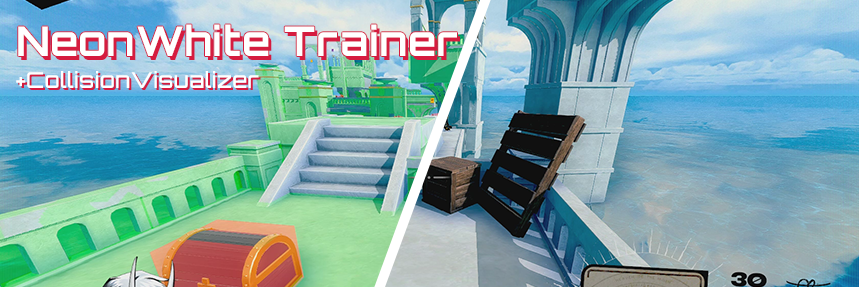

# NeonNeon Trainer
 
The trainer comes packed with awesome features, which the player can toggle them individually to their liking via `Powerprefs.txt` (all off by default).

**Download:** [Assembly-CSharp.dll](https://github.com/Dmgvol/NeonWhite-Trainer/raw/main/Assembly-CSharp.dll)

### Features
- Displays position, speed, levelID.
- Save/Load position.
- Collision visualizer.
- Noclip.
- 3 predefined card spawning.
- Option to prevent the score from being uploaded to leaderboards(Global+Friends).
- Option to save unencrypted save.
- Option to load that unencrypted save.
- - Means you can edit your save or use it as a secondary save file.
- Mod settings are saved into `Powerprefs.txt`.

### Keybindings (in-game)
- [F1] Show help (this)
- [F2] Collision Visualizer
- [F3] Noclip
- [F5] Save position
- [F6] Load position
- [Numpad1] Spawn Pistol card
- [Numpad2] Spawn Machinegun card
- [Numpad3] Spawn Uzi card

### How to use/install
**Installation:**  
- Download the mod and navigate to the game folder: `...\Neon White\Neon White_Data\Managed\`
- Replace `Assembly-CSharp.dll` with the downloaded one (backup the original first).

**Configuration:**  
- Navigate to `C:\Users\<user>\AppData\LocalLow\Little Flag Software, LLC\Neon White\<STEAMID>\`
- And replace `powerprefs.txt` content with [this](https://github.com/Dmgvol/NeonNeon-Trainer/blob/main/powerprefs.txt) file's content.
- - Or just remove/empty that file, launch the game and it will generate a new one for you.
- Once you have the updated file, open it and toggle the ones you want.
 
After that, you're done, launch the game and enjoy.

### Powerprefs
 - DMG_dontUploadToLeaderboards: if set to true, any score or PBs won't be uploaded to the leaderboards(Global+Friends)
 - DMG_saveUnencrypted: if set to true, will save an additional save file but without encryption, named `savedata_NoEncryption.dat`.
 - - Where you can view your stats, times, or even edit and use it via the next parameter.
 - DMG_useNoneEncryptedSave: if set to true, the save-game used path will be redirected to `savedata_NoEncryption.dat`.
 - - Note: Make sure your game has already generated that file, otherwise the game will treat it like a new save.
 - DMG_displaySettings: if set to true, will display these settings in the main menu. (Useful!)
 - DMG_enableTrainer: self-explanatory...
 
 ### Why not use a modloader?
 This mod alters the way NeonWhite uploads score to the cloud, and how it saves, loads, and decrypts save files. 
 Which can not be done that easily using a modloader... 
 All other features can be definitely converted into a modloader mod as a "light-weight" trainer.

